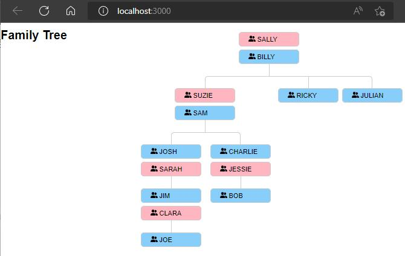
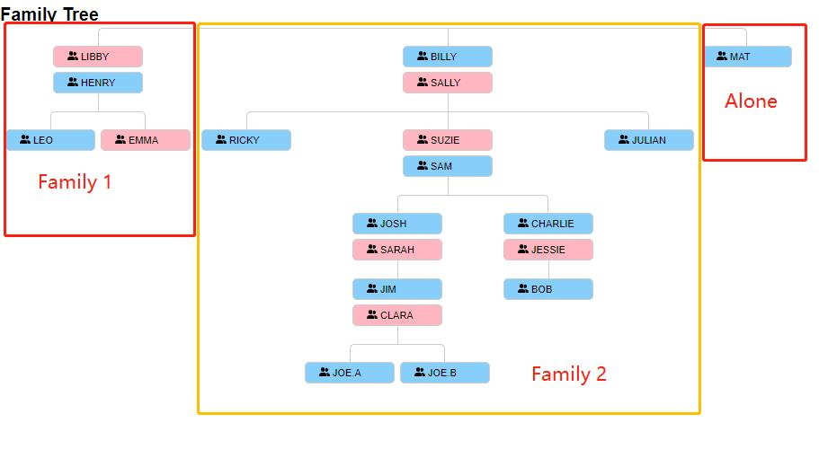

# React Skills Test

# Exercise
Create a UI component that renders hierarchical data following the UI Guideline section below, with or
without the joining lines and icon, and a web application to demonstrate the component, preferably using
create-react-app, preferably typescript and the test data provided.
The requirements are as follows:
- People with a gender of "female" should have background-color lightpink
- People with gender of "male" should have background-color lightblue.
- Each box should contain the person’s name
- The component should be able to consume any family tree, not just the one provided

## Display

- Case 1  
  <Br/>
    
  <Br/>
- Case 2  
  <Br/>
  


## More About FamilyTree Data
- Won't display person who does not have personal information.
  (The person id may exist in children list under one's info but with no more information.)
- Support input data with more than one family with descendants.
- Support display a family with one person.
- Support input data with random sequence.

- I define 'family' as parents the in top level who both don't have parents.

You may find the test data in ```data.ts```

## Design

### Components
- one generation is in one layer
- a couple is a component
- one child is a component

### Others
- use recursion
- tsconfig strict mode
- type-safety

### Data
- add ```couple``` for each couple to index to their partner
- create a dictionary to index each person (```id``` is the key of the dict)

## How to Start
Install required dependencies
### `npm install`

In the project directory, you can run:

### `npm start`

Runs the app in the development mode.\
Open [http://localhost:3000](http://localhost:3000) to view it in the browser.

The page will reload if you make edits.\
You will also see any lint errors in the console.
